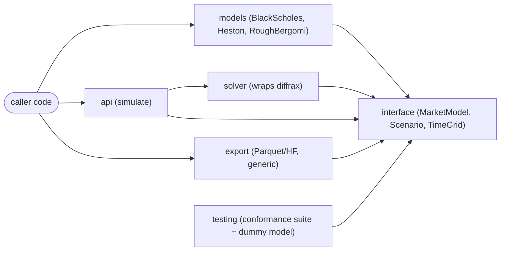
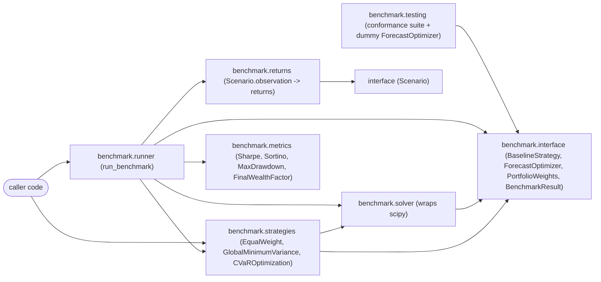
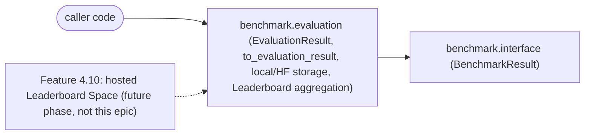

# Architecture Spine — QuantScenarioBench

## Design Paradigm

A linear pipeline with exactly one Strategy-pattern extension point. A Market Model is a typed configuration object satisfying the State-Space Interface (the Strategy); the Solver Layer is the single component that turns a Market Model's drift/diffusion into a simulated path via diffrax; `simulate()` is the orchestrator that wires Market Model + Solver Layer into a `Scenario`; Export is a generic consumer of the `Scenario` schema. No layer except Solver Layer knows diffrax exists; no layer except the caller of `simulate()` knows which concrete Market Model is in play.

Layer → namespace mapping:
- `quantscenariobench.interface` — the State-Space Interface (`MarketModel` ABC), `Scenario`, `TimeGrid`.
- `quantscenariobench.models` — concrete Market Models (`BlackScholes`, `Heston`, `RoughBergomi`), each an `equinox.Module` satisfying `MarketModel`.
- `quantscenariobench.solver` — the internal Solver Layer; the only module that imports `diffrax`.
- `quantscenariobench.api` — `simulate()`, the public orchestrator.
- `quantscenariobench.export` — Parquet/Hugging Face export, generic over `Scenario`.
- `quantscenariobench.testing` — the State-Space Interface conformance suite and its test-only dummy Market Model (FR-11); never imported by non-test code.

**Benchmark layer (added 2026-07-02): the same paradigm applied a second time.** A Traditional Baseline or Forecast Optimizer is a typed configuration object satisfying the Portfolio Optimizer Interface (the Strategy, mirroring `MarketModel`); the Optimizer Solver Layer is the single component that turns a constrained-allocation strategy's problem into weights, currently via `scipy`; `run_benchmark()` is the orchestrator that wires a strategy + returns/Scenarios into a `BenchmarkResult`. The two pipelines share only their entry point for scenario data (`Scenario`, via `quantscenariobench.interface`) — the benchmark layer never imports `quantscenariobench.models` or `quantscenariobench.solver` directly (AD-19). Like the rest of the project, the benchmark layer is JAX-native by default (AD-25); the Optimizer Solver Layer's `scipy` dependency is a single, deliberately bounded, swappable exception — not license for non-JAX tooling to spread elsewhere in `quantscenariobench.benchmark.*`.

- `quantscenariobench.benchmark.interface` — the Portfolio Optimizer Interface (`BaselineStrategy`/`ForecastOptimizer` ABCs), `PortfolioWeights`, `BenchmarkResult`.
- `quantscenariobench.benchmark.strategies` — concrete Traditional Baselines (`EqualWeight`, `GlobalMinimumVariance`, `CVaROptimization`), each an `equinox.Module` satisfying `BaselineStrategy`.
- `quantscenariobench.benchmark.metrics` — the four v1 Metrics (Sharpe, Sortino, Maximum Drawdown, Final Wealth Factor) as plain `MetricFn` functions.
- `quantscenariobench.benchmark.returns` — derives a return series from a `Scenario`'s `observation` (FR-28); the only benchmark-layer module that reads `quantscenariobench.interface.Scenario` directly.
- `quantscenariobench.benchmark.solver` — the internal Optimizer Solver Layer; the only module that imports `scipy`.
- `quantscenariobench.benchmark.runner` — `run_benchmark()`, the public benchmark-layer orchestrator.
- `quantscenariobench.benchmark.testing` — the Portfolio Optimizer conformance suite and its test-only dummy `ForecastOptimizer` (FR-25); never imported by non-test code.

**Evaluation Results layer (added 2026-07-03): a third, smaller paradigm — publication, not a new Strategy.** Unlike the two pipelines above, this layer has no swappable Strategy-pattern extension point: every `BenchmarkResult` is transformed into an `EvaluationResult` by exactly one fixed, pure function (AD-26), which is then written locally, published to the Hub, and aggregated into a Leaderboard — the same generic-consumer posture `quantscenariobench.export` already holds for `Scenario` (AD-5), applied one layer up to `BenchmarkResult`. This layer depends on `quantscenariobench.benchmark.interface` (to read `BenchmarkResult`) only; it never depends on `strategies`, `solver`, `metrics`, `returns`, or `runner` directly, mirroring AD-19's dependency posture.

- `quantscenariobench.benchmark.evaluation` — `EvaluationResult` (AD-26), `to_evaluation_result()` (FR-31), local storage (FR-32), Hugging Face publishing (FR-33), and Leaderboard aggregation (FR-34). A hosted Leaderboard UI (PRD Feature 4.10) is an explicit future phase and is not part of this module — see Deferred.

## Invariants & Rules

### AD-1 — State-Space Interface is an `equinox.Module` ABC

- **Binds:** every Market Model; `quantscenariobench.interface`, `quantscenariobench.models`.
- **Prevents:** structural-typing-only contracts that skip `eqx`'s native pytree/jit integration, and ad hoc per-model pytree registration.
- **Rule:** `MarketModel` is an `equinox.Module` subclass with abstract methods enforced at construction time. Every concrete Market Model subclasses `MarketModel`; none registers itself as a pytree by hand.

### AD-2 — `Scenario` is an `equinox.Module` with a fixed dynamic/static field split

- **Binds:** `simulate()`'s return type; `quantscenariobench.export`'s input type.
- **Prevents:** `metadata` (strings, ints, version identifiers) leaking into traced pytree leaves and breaking `jit`/`vmap`.
- **Rule:** `Scenario.observation` and `Scenario.latent_state` are dynamic (traced) `eqx.Module` fields. `Scenario.metadata` is `eqx.field(static=True)` — pytree aux_data, never a traced leaf.

### AD-3 — Randomness defaults to `diffrax.VirtualBrownianTree`; materialization is a separate path

- **Binds:** `quantscenariobench.solver`.
- **Prevents:** per-model divergence in how Brownian motion is constructed; a single code path silently paying full noise-array memory cost regardless of whether the caller wants it.
- **Rule:** The Solver Layer constructs Brownian motion via `diffrax.VirtualBrownianTree` by default (FR-4's reproducibility holds via seed/PRNG provenance, not via a stored noise path). When a caller requests materialized `Randomness` (FR-5), the Solver Layer takes an explicit, separate construction path — never a runtime branch inside the default path.

### AD-4 — Solver Layer wraps `diffrax` exclusively, behind one fixed drift/diffusion signature

- **Binds:** all Market Model implementations (FR-7, FR-8, FR-9); the State-Space Extensibility Contract (FR-10).
- **Prevents:** two Market Models independently choosing incompatible `TimeGrid`→`SaveAt` mappings, noise construction, or solver configuration that both "pass" yet produce inconsistent `Scenario` semantics; two Market Models exposing drift/diffusion under different call signatures; a Market Model's dynamics being called by anything other than the Solver Layer.
- **Rule:** `diffrax` is imported only inside `quantscenariobench.solver`. Every Market Model exposes its dynamics as `_drift(self, t, state) -> PyTree` and `_diffusion(self, t, state) -> PyTree` — an identical signature across all models, with no model-specific extra arguments (model parameters live on `self`, fixed at construction). The leading underscore marks these as Solver-Layer-internal: not part of the package's supported public surface, which is `simulate()` alone. A Market Model never constructs a `diffrax.Term`, `SaveAt`, or solver instance itself.

### AD-5 — Dataset export is generic over the `Scenario` schema

- **Binds:** Feature 4.4 (FR-12 through FR-15).
- **Prevents:** per-model export hooks reintroducing Market-Model-specific coupling into the export pipeline, which would violate FR-10's "zero changes to the export pipeline" guarantee.
- **Rule:** `quantscenariobench.export` derives Parquet columns by pytree-flattening a `Scenario` (per AD-2's dynamic/static split). It imports `quantscenariobench.interface` only — never a concrete Market Model from `quantscenariobench.models`.

### AD-6 — `equinox` is a project-wide pytree convention, not a diffrax-only dependency

- **Binds:** every pytree-bearing type in the project (Market Model configs, `Scenario`).
- **Prevents:** two different pytree mechanisms (hand-rolled `tree_util` registration vs. `eqx.Module`) coexisting in the same codebase.
- **Rule:** Every JAX-PyTree-typed dataclass in the project — Market Model parameter classes and `Scenario` alike — is an `equinox.Module`. None uses `jax.tree_util.register_pytree_node_class` directly.

### AD-7 — float64 (JAX x64) is the fixed v1 precision policy

- **Binds:** all Market Model simulation; FR-7/FR-8 correctness-tolerance checks; `quantscenariobench.solver`.
- **Prevents:** per-model float32/float64 divergence making cross-model comparison or closed-form tolerance checks meaningless; x64 silently never getting enabled because a caller imported a submodule directly instead of going through `quantscenariobench.api`.
- **Rule:** `jax.config.update("jax_enable_x64", True)` is called exactly once, as top-level code in `quantscenariobench/__init__.py`. Python import semantics guarantee the package `__init__` runs before any submodule's code, regardless of whether the caller imports `.api`, `.models`, or any other submodule directly — so this cannot be bypassed by import path. No Market Model or Solver Layer code overrides dtype per-call.

### AD-8 — Metadata's minimum guaranteed field set is fixed

- **Binds:** `Scenario.metadata`; dataset card generation (FR-15); resolves PRD Open Question 2.
- **Prevents:** two Market Models or two dataset exports independently choosing different provenance fields or representations, breaking FR-15's "every card has these fields" guarantee or Export's generic flattening (AD-5).
- **Rule:** `Scenario.metadata` always carries, at minimum: `seed`, `prng_key_info`, `model_name`, `model_version`, `parameters`, `time_grid`, `n_paths`, `library_version`, `dataset_version`, `generated_at`. `parameters` is always the Market Model's own parameter `eqx.Module` instance — never a hand-rolled dict or other ad hoc representation — so Export's pytree-flattening (AD-5) sees one consistent shape regardless of which Market Model produced it. A Market Model may not omit any field; it may not add a different name for any of them.

### AD-9 — Dependency direction is one-way: Models → Interface ← Solver/API/Export/Testing

- **Binds:** all modules (`quantscenariobench.*`).
- **Prevents:** a Market Model importing the Solver Layer, the public API, or Export directly — which would let a model bypass the State-Space Interface as the sole integration point; the conformance test suite (`testing`) importing concrete models or Export and so testing something other than the interface contract itself.
- **Rule:** see diagram. `equinox` is a project-wide third-party dependency (per AD-6) and may be imported by `interface`, `models`, and `solver` alike — it is not solver-exclusive. `diffrax` remains solver-exclusive: only `quantscenariobench.solver` imports it. Beyond that: a Market Model module may import only `quantscenariobench.interface` (+ `equinox`). `quantscenariobench.solver` may import `quantscenariobench.interface` (+ `equinox`, `diffrax`). `quantscenariobench.export` may import only `quantscenariobench.interface` (+ `equinox`) — never `models`, `solver`, or `testing`. `quantscenariobench.testing` may import only `quantscenariobench.interface` (+ `equinox`, test tooling) — never `models` or `export`; its dummy Market Model is defined inside `testing` itself, not borrowed from `models`. Only `quantscenariobench.api` may import concrete Market Models, and only as caller-supplied arguments — it never hardcodes a model name.

### AD-10 — Correctness-check references are independently implemented, never borrowed from a bundled quant library

- **Binds:** FR-7, FR-8, FR-9 correctness checks; `quantscenariobench.testing`. **Amended 2026-07-02:** also binds the v1 Metrics (FR-16–FR-19) and Traditional Baselines (FR-20–FR-22) correctness checks, per the PRD's explicit extension of this convention to Features 4.5/4.6 (SM-7).
- **Prevents:** a correctness check silently depending on `tf-quant-finance`, `QuantLib`, or another general-purpose quant library as its reference implementation — making the project's own pricing/sensitivity logic an unverified pass-through rather than an independent implementation (the brief's "not a thin wrapper" framing, addendum point 2).
- **Rule:** Every closed-form, semi-closed-form, or statistical reference value used to validate a Market Model (Black-Scholes analytic price, Heston characteristic-function price, rBergomi statistical/aBergomi-based sanity check) is implemented within QuantScenarioBench's own code. No correctness check imports a pricing formula from a third-party quant library as its source of truth. **Amended 2026-07-02:** the same rule applies to Metrics and Traditional Baselines — no correctness test for Sharpe/Sortino/Max Drawdown/Final Wealth Factor, Equal Weight, GMV, or CVaR Optimization imports its expected/reference value from `empyrical`, `quantstats`, `PyPortfolioOpt`, `Riskfolio-Lib`, or any other portfolio-analytics library; reference values are hand-derived or independently implemented within QuantScenarioBench's own test code, even though `scipy` (AD-14) is used for the *production* solver path.

### AD-11 — Public API stability follows semantic versioning, independent of dataset versioning

- **Binds:** `simulate()`, `Scenario`, the State-Space Interface (`MarketModel`, `TimeGrid`); resolves the PRD's Cross-Cutting NFR "Public API stability policy." **Amended 2026-07-02:** also binds `BaselineStrategy`, `ForecastOptimizer`, and the `BenchmarkResult` schema.
- **Prevents:** a breaking change to the public API shipping in a non-major library release; conflating library version bumps with dataset version bumps (FR-14 already fixes datasets as independently versioned — this AD is the library-side mirror of that same discipline).
- **Rule:** Any backward-incompatible change to `simulate()`'s signature, `Scenario`'s field set, or the `MarketModel`/`TimeGrid` contract requires a major version bump of the `quantscenariobench` package, tracked separately from any `dataset_version` value in `Metadata` (AD-8). **Amended 2026-07-02:** the same major-version-bump requirement applies to a backward-incompatible change to `BaselineStrategy`'s or `ForecastOptimizer`'s `allocate()` signature, or to the `BenchmarkResult` schema (FR-29) — the Portfolio Optimizer Interface and `BenchmarkResult` are first-class public API surface, not internal detail.

### AD-12 — `TimeGrid` is an explicit, ordered time-point sequence, not a generative spec

- **Binds:** FR-3; every Market Model's `_drift`/`_diffusion` signature (AD-4) and the Solver Layer's `TimeGrid`→`SaveAt` mapping (AD-4).
- **Prevents:** one Market Model accepting `TimeGrid` as a `(start, stop, steps)`-equivalent spec it expands internally, while another expects pre-expanded points — silently disagreeing on what `TimeGrid` "is."
- **Rule:** `TimeGrid` always carries an explicit, already-ordered array of time points (supporting non-uniform spacing per FR-3); no Market Model or the Solver Layer accepts or produces an alternate `(start, stop, steps)` representation.

### AD-13 — Portfolio Optimizer Interface is an `equinox.Module` ABC, split into `BaselineStrategy` and `ForecastOptimizer`

- **Binds:** every Traditional Baseline and future Forecast Optimizer; `quantscenariobench.benchmark.interface`, `quantscenariobench.benchmark.strategies`. Resolves PRD Open Question 15.
- **Prevents:** a structural-typing-only Protocol contract that skips `eqx`'s native pytree/jit integration (breaking AD-6's project-wide convention); a strategy implementation inventing its own ad hoc `allocate`-equivalent signature.
- **Rule:** `BaselineStrategy(eqx.Module, ABC)` fixes one abstract method, `allocate(historical_returns: Float[Array, "t n"]) -> PortfolioWeights`. `ForecastOptimizer(eqx.Module, ABC)` fixes `allocate(historical_returns: Float[Array, "t n"], forecast: Float[Array, "n"]) -> PortfolioWeights` — `forecast`'s shape is fixed by AD-21, not left as an unconstrained `PyTree`. Every concrete strategy — Equal Weight, GMV, CVaR Optimization, and any future Forecast Optimizer — subclasses one of these two ABCs and implements only `allocate`; none registers itself as a pytree by hand.

### AD-14 — Optimizer Solver Layer isolates the non-JAX numerical solver behind one boundary

- **Binds:** `GlobalMinimumVariance` and `CVaROptimization` (FR-21, FR-22); `quantscenariobench.benchmark.solver`. Resolves PRD Open Question 10. Its non-JAX-native scope is deliberately bounded by AD-25.
- **Prevents:** each constrained-optimization strategy independently choosing an incompatible solver library or constraint convention; a non-JAX dependency leaking into strategy code that should stay swappable; two strategies producing weights under different constraint semantics without a shared default; two implementers of `GlobalMinimumVariance` disagreeing on when the closed-form path applies versus the solver path, or on how a JAX array crosses the boundary into `scipy` and back.
- **Rule:** `quantscenariobench.benchmark.solver` is the only module that imports `scipy`; it is responsible for converting a JAX array to a plain NumPy array on the way in and back to a JAX array on the way out — no other benchmark module performs this conversion. `GlobalMinimumVariance` takes a required `long_only: bool` constructor argument (not an implicit runtime toggle) that selects between two fixed paths: `long_only=False` uses `jax.numpy.linalg` directly (closed-form covariance inversion, no solver call, fully JAX-native); `long_only=True` calls into `quantscenariobench.benchmark.solver` (`scipy.optimize.minimize`, SLSQP). `CVaROptimization`'s Rockafellar–Uryasev linear program always calls into `quantscenariobench.benchmark.solver` (`scipy.optimize.linprog`). Neither strategy imports `scipy` directly — both call `quantscenariobench.benchmark.solver.solve_allocation(...)`, whose *internal* implementation is free to change (e.g. to a future JAX-native QP/LP solver, AD-25) without either strategy class changing. All v1 constrained baselines default to long-only (`PortfolioWeights`' non-negativity invariant, AD-20, applies universally — this is stronger than a per-strategy convention). `[ASSUMPTION: long-only chosen as the v1 default — resolves PRD Open Question 10's constraint dimension; short positions are a deferred extension, not confirmed by user]` A solver call that fails to converge raises (e.g. a `QuantScenarioBenchSolverError`) rather than silently returning a degenerate or unconverged weight vector. `EqualWeight` needs no solver and computes its weights directly, entirely in `jax.numpy` (AD-25).

### AD-15 — CVaR confidence level is an explicit, required, recorded parameter

- **Binds:** `CVaROptimization` (FR-22); resolves PRD Open Question 11.
- **Prevents:** two call sites silently using different confidence levels while assuming their `BenchmarkResult`s are comparable; a hidden internal default drifting across versions without appearing in the recorded strategy parameters.
- **Rule:** `CVaROptimization.confidence_level` is a required constructor argument — never an internal hardcoded default. The v1 default value for callers who don't specify one explicitly is `0.95`, confirmed by the user on 2026-07-02. The value is always part of the strategy's recorded identity/parameters (FR-22), so a `BenchmarkResult` stays reproducible per AD-17.

### AD-16 — Return-series derivation is one function, one convention

- **Binds:** `quantscenariobench.benchmark.returns`; Metrics (Feature 4.5), Traditional Baselines/Portfolio Optimizer Interface (Feature 4.6/4.7), and the Benchmark Runner (Feature 4.8), all of which consume its output. Resolves PRD Open Question 16.
- **Prevents:** a Scenario from `simulate()` and a Scenario loaded from a published Benchmark Dataset being converted to "returns" via different formulas, silently making cross-source or cross-model portfolios non-comparable; the same conversion logic being reimplemented (and drifting) in more than one place.
- **Rule:** Returns are simple/arithmetic period returns, `return(t) = (price(t) - price(t-1)) / price(t-1)`, computed once per `TimeGrid` step directly from `Scenario.observation` — no resampling to a different frequency in v1. Confirmed by the user on 2026-07-02: arithmetic return (not log return), per-`TimeGrid`-step frequency. Implemented in exactly one function, `quantscenariobench.benchmark.returns.derive_returns(scenario) -> Float[Array, "t"]`, written entirely in `jax.numpy` and `jit`-compatible (AD-25); the Benchmark Runner calls it and no other module reimplements the conversion inline.

### AD-17 — `BenchmarkResult` is a plain, JSON-native dataclass, not an `equinox.Module`

- **Binds:** `quantscenariobench.benchmark.runner`'s return type; FR-29.
- **Prevents:** a contributor assuming AD-6's project-wide `eqx.Module` convention extends to `BenchmarkResult` and wrapping it in a traced pytree it has no use for — a `BenchmarkResult` is a terminal artifact, never re-traced through `jit`/`vmap`, unlike `Scenario` (AD-2).
- **Rule:** `BenchmarkResult` is a plain immutable Python dataclass (`@dataclasses.dataclass(frozen=True)`) with only JSON-native field types (`str`, `float`, `int`, `dict`, `list`) — no JAX arrays, no `eqx.Module` fields. Its JSON path is a direct structural dump (`dataclasses.asdict` + `json.dumps`), not a pytree-flatten — contrast with AD-5's `Scenario`-flattening export path.

### AD-18 — Metrics are pure functions the Runner calls generically, never by name

- **Binds:** `quantscenariobench.benchmark.metrics`; `quantscenariobench.benchmark.runner`.
- **Prevents:** adding a new Metric requiring an edit inside the Runner's orchestration logic (a per-metric `if`/branch) — the direct failure mode this update's extensibility priority is meant to close off.
- **Rule:** Every Metric matches `MetricFn = Callable[[Float[Array, "t"]], float]` — a Portfolio Return series in, a scalar out — defined in `quantscenariobench.benchmark.metrics`; none is a method on `BenchmarkRunner`/`run_benchmark`, and none takes anything beyond the return series. Every `MetricFn` is written entirely in `jax.numpy`, `jit`-compatible, and never calls `scipy` or plain NumPy (AD-25) — Sharpe, Sortino, Maximum Drawdown, and Final Wealth Factor all need nothing beyond array reductions, so none of the four v1 Metrics needs the Optimizer Solver Layer's non-JAX exception. Every `MetricFn` carries a `.name: str` attribute. `run_benchmark()` accepts a metrics registry — an explicit ordered `Sequence[MetricFn]` (default: the four v1 `MetricFn`s in a fixed tuple, never a `dict`) — as an argument and iterates over it generically; it raises at call time if two entries in the registry share a `.name`, rather than silently allowing one to shadow the other. A new Metric is added by writing a new `MetricFn` and adding it to the registry passed in — zero changes to `quantscenariobench.benchmark.runner`'s source. Sharpe and Sortino (FR-16, FR-17) return a fixed sentinel value of `0.0` when their denominator (return standard deviation / downside deviation) is exactly zero, rather than raising or returning `NaN`/`inf`.

### AD-19 — Benchmark-layer dependency direction mirrors AD-9

- **Binds:** all `quantscenariobench.benchmark.*` modules.
- **Prevents:** a Traditional Baseline importing the Optimizer Solver Layer's caller (the Runner) or another strategy directly, bypassing the Portfolio Optimizer Interface as the sole integration point (the same failure mode AD-9 prevents for Market Models); the benchmark-layer conformance suite testing something other than the interface contract itself; a benchmark-layer module reaching back into the unrelated scenario-generation Strategy/Solver (`quantscenariobench.models`/`quantscenariobench.solver`).
- **Rule:** see diagram. `quantscenariobench.benchmark.strategies` may import only `quantscenariobench.benchmark.interface`, `quantscenariobench.benchmark.solver`, and `equinox` — never `quantscenariobench.benchmark.runner` or `quantscenariobench.benchmark.testing`. `quantscenariobench.benchmark.metrics` and `quantscenariobench.benchmark.returns` depend on nothing benchmark-specific beyond plain arrays / `quantscenariobench.interface` (the latter, only to read `Scenario.observation`) — neither imports `strategies` or `runner`. `quantscenariobench.benchmark.testing` may import only `quantscenariobench.benchmark.interface` (+ `equinox`, test tooling) — never `strategies` or `runner`; its dummy `ForecastOptimizer` is defined inside `testing` itself (mirrors AD-9's treatment of the scenario-generation dummy Market Model). Only `quantscenariobench.benchmark.runner` may import concrete strategies, and only as caller-supplied arguments — it never hardcodes one. No `quantscenariobench.benchmark.*` module imports `quantscenariobench.models` or `quantscenariobench.solver`; the only connection to scenario generation is a `Scenario` flowing in via `quantscenariobench.interface`, already common ground with the rest of the package.

### AD-20 — `PortfolioWeights` is a validated value type, not a per-strategy convention

- **Binds:** every `BaselineStrategy`/`ForecastOptimizer.allocate()` return value; every consumer of `PortfolioWeights` (Metrics, the Benchmark Runner).
- **Prevents:** a strategy returning a technically-`allocate()`-conformant but leveraged, negative-weight, or non-normalized vector that a Metric or the Runner silently mis-scores — the exact "compliant but incompatible" gap the adversarial review constructed by noting AD-14's long-only rule bound only `GlobalMinimumVariance`/`CVaROptimization`, not `EqualWeight` or a future `ForecastOptimizer`.
- **Rule:** `PortfolioWeights` is `Float[Array, "n"]` with three invariants enforced at construction (not left to strategy discipline): entries sum to `1.0` within `1e-6` tolerance, every entry is `>= 0` (long-only, universal for v1 — not just for the constrained baselines named in AD-14), and `n` equals the number of constituent assets in the call. A strategy whose internal computation would violate any of these raises rather than returning a malformed `PortfolioWeights`.

### AD-21 — `ForecastOptimizer.forecast` is a fixed-shape point forecast

- **Binds:** `ForecastOptimizer` (FR-24); any future concrete Forecast Optimizer (PatchTST, iTransformer, TimeMixer wrappers, or otherwise).
- **Prevents:** two `ForecastOptimizer` implementers independently choosing incompatible `forecast` shapes/semantics (e.g. one a point forecast, another a distributional/quantile forecast) while both satisfy AD-13's signature to the letter — the exact gap the adversarial review constructed, which would defeat this update's "plug in a new Forecast Model with minimal changes" goal.
- **Rule:** `forecast` is `Float[Array, "n"]` — one predicted next-period return per constituent asset (a point forecast), matching `historical_returns`' asset ordering. Distributional or quantile forecasts are out of scope for v1's `ForecastOptimizer`; a future need for them is a new, parallel interface, not a silent reinterpretation of this shape (see Deferred).

### AD-22 — Multi-asset composition requires aligned `TimeGrid`s and price-series `Scenario.observation`

- **Binds:** `quantscenariobench.benchmark.runner` (FR-26); `quantscenariobench.benchmark.returns` (FR-28).
- **Prevents:** two compliant implementations of "stack N Scenarios into a returns matrix" silently disagreeing on time alignment (one requiring equal-length `TimeGrid`s, another padding/truncating mismatched ones) — the multi-asset assembly rule the PRD's FR-26 required but left unspecified; and a `derive_returns` caller assuming `Scenario.observation` is always a scalar, strictly-positive price series when AD-1/AD-2/AD-4 never actually fix that semantic for every possible Market Model.
- **Rule:** `run_benchmark()` requires every constituent Scenario in a multi-asset call to carry an identical `TimeGrid` (same length, same time points); a mismatch raises before any return derivation is attempted — no implicit padding, truncation, or resampling to reconcile misaligned grids. `quantscenariobench.benchmark.returns.derive_returns` (AD-16) requires `Scenario.observation` to be a one-dimensional, strictly-positive price series; a Market Model whose `observation` is not of this shape is not usable as a benchmark-layer asset in v1 — this is a new constraint the benchmark layer imposes on `Scenario.observation` beyond what Feature 4.1–4.3 require of it.

### AD-23 — Strategy dispatch is by `isinstance`; allocation runs once per `run_benchmark()` call against a caller-supplied window split

- **Binds:** `quantscenariobench.benchmark.runner` (FR-27).
- **Prevents:** two implementers of the Runner's "call the right `allocate()`" logic diverging (one `isinstance`-branching, another silently widening `BaselineStrategy.allocate()`'s signature to accept an optional forecast) — the dispatch-mechanism gap the adversarial review found; and the PRD's confirmed FR-27 default (fit once, static buy-and-hold, lookback window from the same Scenario) having zero representation anywhere in the spine, as the rubric and reconciliation reviews both flagged as the update's most significant gap.
- **Rule:** `run_benchmark()` dispatches via `isinstance(strategy, ForecastOptimizer)`: if true, it calls `strategy.allocate(historical_returns, forecast)`, requiring a `forecast` argument to have been supplied by the caller; otherwise it calls `strategy.allocate(historical_returns)` and rejects a caller-supplied `forecast` as an error. `run_benchmark()` takes two explicit, caller-supplied return-series arguments — `historical_returns` (the lookback/fit window) and `evaluation_returns` (the scored window) — rather than inferring a split point internally; per FR-27, both are drawn from the same Scenario(s) in v1. `allocate()` is called exactly once per `run_benchmark()` call, and the resulting `PortfolioWeights` are applied unchanged across the entire `evaluation_returns` window — no intra-run refitting or rebalancing.

### AD-24 — `BenchmarkResult`'s minimum guaranteed field set is fixed

- **Binds:** `quantscenariobench.benchmark.runner`'s return value; FR-29. Resolves PRD Open Question 14 — the one open item the PRD handed to Architecture that AD-8 already had a direct precedent for (Metadata's minimum field set) but which this update initially left unfixed.
- **Prevents:** two compliant `BenchmarkResult` producers disagreeing on shape (e.g. nested vs. flattened metrics, present vs. absent provenance) — breaking FR-29's "every result has these fields" review gate the same way an unfixed field set would have broken FR-15's dataset-card gate absent AD-8.
- **Rule:** `BenchmarkResult` always carries, at minimum: `strategy_name` (str), `strategy_parameters` (dict, JSON-native — e.g. `CVaROptimization`'s `confidence_level`), `metrics` (a flat `dict[str, float]` keyed by each `MetricFn.name`, never nested), `asset_scenario_ids` (a list identifying each constituent Scenario/dataset used, sufficient to reproduce the run), `time_grid_reference` (the shared `TimeGrid` identity per AD-22), `library_version` (str), and `generated_at` (timestamp) — deliberately mirroring AD-8's Metadata field set where the concepts overlap (`library_version`, `generated_at`). A `BenchmarkResult` producer may not omit any of these fields.

### AD-25 — Benchmark layer is JAX-native by default; the Optimizer Solver Layer is the sole, bounded, swappable exception

- **Binds:** `quantscenariobench.benchmark.metrics`, `quantscenariobench.benchmark.returns`, `quantscenariobench.benchmark.runner`, `quantscenariobench.benchmark.interface`, `EqualWeight` and `GlobalMinimumVariance`'s unconstrained path (`quantscenariobench.benchmark.strategies`). Reinforces the project's JAX-native identity (AD-7's precedent) for the benchmark layer specifically, per explicit user direction (2026-07-02).
- **Prevents:** NumPy/SciPy quietly creeping into Metrics, return derivation, or Runner orchestration where a JAX-native implementation is entirely practical — eroding the project's JAX-native identity one convenience import at a time; a future contributor treating `quantscenariobench.benchmark.solver`'s use of `scipy` (AD-14) as license to reach for non-JAX tooling anywhere else in the benchmark layer; the Optimizer Solver Layer's `scipy` dependency becoming load-bearing enough elsewhere that it can no longer be swapped out later.
- **Rule:** Every module named in Binds is implemented entirely in `jax.numpy`/`equinox` — `jit`/`vmap`-compatible, no NumPy or SciPy calls. `quantscenariobench.benchmark.solver` (AD-14) is the sole, deliberately bounded exception, used only for `GlobalMinimumVariance`'s long-only-constrained path and `CVaROptimization`'s linear program. This exception exists because, as of this update, no JAX-native constrained-optimization library was judged sufficiently mature for a v1 architectural commitment: `qpax` (a differentiable, batchable JAX-native QP solver) and `linrax`/`MPAX` (JAX-native LP solvers) exist and were considered, but are 2024–2025-era tools without scipy's decades of production hardening — noted as future replacement candidates in Deferred, not adopted now. The boundary is designed for that future swap: strategies call only `quantscenariobench.benchmark.solver.solve_allocation(...)` (AD-14); replacing its internals with a JAX-native solver requires no change to `strategies`, `runner`, `metrics`, `returns`, or any public type.

### AD-26 — `EvaluationResult` is a publication-layer schema derived from `BenchmarkResult`, never a replacement for it

- **Binds:** new `quantscenariobench.benchmark.evaluation` module; PRD Feature 4.9 (FR-30–FR-34). Resolves PRD Open Question 17 (partially — required fields only; the optional-field set remains open, see Deferred).
- **Prevents:** a contributor reshaping `BenchmarkResult`'s in-memory `metrics` dict (AD-24) to satisfy a publishing or Leaderboard-rendering convenience, breaking AD-17's "terminal artifact, never re-traced" guarantee and every existing in-process consumer of `BenchmarkResult`; two publishing implementers independently inventing incompatible published shapes, the same class of gap AD-24 closed for `BenchmarkResult` and AD-8 closed for `Metadata`.
- **Rule:** `BenchmarkResult` (AD-17, AD-24) remains the sole runtime representation, produced by `run_benchmark()`, and is unchanged by this AD — it is never itself published. `EvaluationResult` is a distinct, plain, immutable, JSON-native dataclass (the same posture AD-17 fixes for `BenchmarkResult`: no JAX arrays, no `eqx.Module` fields), produced by exactly one pure function, `quantscenariobench.benchmark.evaluation.to_evaluation_result(result: BenchmarkResult) -> EvaluationResult` (FR-31), that never mutates or subclasses `BenchmarkResult`. `EvaluationResult` always carries, at minimum, the fields FR-30 fixes: `schema_version`, `result_id`, `strategy` (`name`, `parameters` — sourced from `BenchmarkResult.strategy_name`/`strategy_parameters`), `benchmark_dataset` (`asset_scenario_ids`, `time_grid_reference` — sourced from `BenchmarkResult`'s fields of the same concepts), `metrics`, `library_version`, and `generated_at`. `EvaluationResult.metrics` is deliberately reshaped from `BenchmarkResult.metrics`'s flat `dict[str, float]` (AD-24) into an ordered list of `{name, value}` records, matching the Hugging Face `model-index.results[].metrics[]` convention that Hub rendering and Leaderboard aggregation (FR-34) both consume — this divergence is intentional, not an inconsistency with AD-24, because the two types serve different consumers (in-process code vs. the Hub) and AD-24 binds `BenchmarkResult`'s shape only. `EvaluationResult` is the canonical published representation: local storage (FR-32), Hugging Face publishing (FR-33), and Leaderboard aggregation (FR-34) all consume `EvaluationResult` exclusively — none reads a `BenchmarkResult` directly.







## Consistency Conventions

| Concern | Convention |
| --- | --- |
| Naming (entities, files, interfaces) | Market Model classes are PascalCase nouns matching Glossary terms exactly (`BlackScholes`, `Heston`, `RoughBergomi`); the contract type is `MarketModel`; the public entrypoint is `simulate`; the Solver Layer's internal entrypoint is `solve_sde`. |
| Metadata field names | Fixed per AD-8: `seed`, `prng_key_info`, `model_name`, `model_version`, `parameters`, `time_grid`, `library_version`, `dataset_version`, `generated_at`. No Market Model introduces a synonym for any of these. |
| Soft validation (FR-6) | A single warning class (e.g. `QuantScenarioBenchValidationWarning`) is used for every research-constraint violation (Feller condition and future equivalents) across all Market Models — never a bare `UserWarning`, never a model-specific subclass. |
| State & cross-cutting (precision, randomness) | float64 fixed per AD-7; randomness construction lives only in the Solver Layer per AD-3/AD-4; no module outside `quantscenariobench.solver` touches a JAX `PRNGKey` split for simulation purposes. |
| Benchmark-layer naming *(added 2026-07-02)* | Traditional Baseline classes are PascalCase nouns matching the PRD Glossary exactly (`EqualWeight`, `GlobalMinimumVariance`, `CVaROptimization`); the contract types are `BaselineStrategy`/`ForecastOptimizer`; the public entrypoint is `run_benchmark` (a function, mirroring `simulate`, not a class); the Optimizer Solver Layer's internal entrypoint is `solve_allocation`, mirroring `solve_sde`. |
| Metric function signature *(added 2026-07-02)* | Every Metric is a `MetricFn` per AD-18: one Portfolio Return array in, one `float` out. No Metric takes a Market Model, a Scenario, or a strategy as an argument — only the derived return series. |
| Evaluation Results naming *(added 2026-07-03)* | The published type is `EvaluationResult` (never a synonym like `PublishedResult` or `LeaderboardEntry`); the transform is `to_evaluation_result` (mirrors `derive_returns`'s plain-function convention, AD-16); metrics are always a list of `{name, value}` records in `EvaluationResult`, never the flat dict `BenchmarkResult.metrics` uses (AD-24, AD-26) — no module reintroduces the flat-dict shape at the publication boundary. |

## Stack

| Name | Version |
| --- | --- |
| Python | >=3.11 (raised from PRD's [ASSUMPTION] of >=3.10 — driven by diffrax's minimum; PRD needs reconciling) |
| jax | >=0.4.38 (diffrax 0.7.2's pin) |
| diffrax | 0.7.2 |
| equinox | >=0.11.10 (diffrax 0.7.2's pin) |
| scipy | >=1.16 *(added 2026-07-02, verified against PyPI 2026-07-02)* — floor pin, not an exact pin like diffrax: scipy's `optimize.minimize`/`optimize.linprog` API used here (AD-14) has been stable across recent major versions, and package resolvers pick whatever scipy release is compatible with the installed Python. 1.16.0 (Jun 2025) is the first release whose own floor is Python >=3.11 (matching the project's floor); the newest release still compatible with Python 3.11 is 1.17.0 (Jan 2026) — 1.18.0 (Jun 2026) raised scipy's own floor to Python >=3.12. |

## Structural Seed

```text
quantscenariobench/
  interface/       # MarketModel ABC, Scenario, TimeGrid — the only module every other module may depend on
  models/           # BlackScholes, Heston, RoughBergomi — each depends on interface only
  solver/           # internal Solver Layer — the only module that imports diffrax
  api/              # simulate() — depends on interface + solver; accepts any conforming Market Model
  export/           # Parquet / Hugging Face publishing — depends on interface only, generic over Scenario
  testing/          # State-Space Interface conformance suite + test-only dummy Market Model (FR-11)
  benchmark/                # added 2026-07-02 — portfolio benchmarking layer, own internal pipeline
    interface/               # BaselineStrategy/ForecastOptimizer ABCs, PortfolioWeights, BenchmarkResult
    strategies/              # EqualWeight, GlobalMinimumVariance, CVaROptimization — depend on benchmark.interface + benchmark.solver only
    metrics/                 # Sharpe, Sortino, MaxDrawdown, FinalWealthFactor — pure MetricFns
    returns/                 # Scenario.observation -> return-series derivation (FR-28); depends on top-level interface only
    solver/                  # internal Optimizer Solver Layer — the only benchmark module that imports scipy
    runner/                  # run_benchmark() — depends on benchmark.interface/strategies/solver/returns/metrics
    testing/                 # Portfolio Optimizer conformance suite + test-only dummy ForecastOptimizer (FR-25)
    evaluation/              # added 2026-07-03 — EvaluationResult, to_evaluation_result(), local/HF storage, Leaderboard aggregation; depends on benchmark.interface only (FR-30-FR-34)
```

## Capability → Architecture Map

| Capability / Area | Lives in | Governed by |
| --- | --- | --- |
| Feature 4.1 Core Simulation API (FR-1–FR-6) | `quantscenariobench.api`, `quantscenariobench.interface` | AD-1, AD-2, AD-3, AD-7, AD-11, AD-12 |
| Feature 4.2 v1 Market Model Zoo (FR-7–FR-9) | `quantscenariobench.models` | AD-1, AD-4, AD-6, AD-7, AD-10 |
| Feature 4.3 State-Space Extensibility Contract (FR-10–FR-11) | `quantscenariobench.interface`, `quantscenariobench.testing` | AD-1, AD-4, AD-9, AD-10 |
| Feature 4.4 Benchmark Dataset Export & Publishing (FR-12–FR-15) | `quantscenariobench.export` | AD-2, AD-5, AD-8, AD-11 |
| Feature 4.5 Portfolio Performance Metrics (FR-16–FR-19) *(added 2026-07-02)* | `quantscenariobench.benchmark.metrics` | AD-10, AD-18, AD-20, AD-25 |
| Feature 4.6 Traditional Baseline Strategies (FR-20–FR-22) *(added 2026-07-02)* | `quantscenariobench.benchmark.strategies` | AD-10, AD-13, AD-14, AD-15, AD-20, AD-25, AD-6 |
| Feature 4.7 Portfolio Optimizer Extensibility Contract (FR-23–FR-25) *(added 2026-07-02)* | `quantscenariobench.benchmark.interface`, `quantscenariobench.benchmark.testing` | AD-13, AD-19, AD-20, AD-21 |
| Feature 4.8 Benchmark Runner & Results (FR-26–FR-29) *(added 2026-07-02)* | `quantscenariobench.benchmark.runner`, `quantscenariobench.benchmark.returns` | AD-16, AD-17, AD-18, AD-19, AD-22, AD-23, AD-24, AD-25, AD-11 |
| Feature 4.9 Evaluation Results & Leaderboard (FR-30–FR-34) *(added 2026-07-03)* | `quantscenariobench.benchmark.evaluation` | AD-26, AD-17, AD-24, AD-19 |

## Deferred

- **Release/publish operational envelope** — PyPI release process for the library, and what triggers/authenticates a Hugging Face dataset publish. Not coached in this session (stated priority was the State-Space Interface and extension points); a real structural dimension, intentionally left open rather than silently decided.
- **Runtime/compute environment** — whether `simulate()` and dataset generation are expected to run on CPU, GPU, or TPU, and any associated infra/provider choice. GPU/TPU performance is explicitly a non-goal for v1 (PRD §5), but the baseline execution environment itself was not architected and is a real gap in the operational envelope, not just a performance question.
- **Dataset generation and hosting cost at scale** (PRD Open Question 7) — no budget, ceiling, or architectural mitigation (e.g. sampling fewer paths, sharding) has been decided.
- **Parquet row granularity** (PRD Open Question 4, FR-12) — AD-5 fixes that export is column-generic via pytree-flattening, but row granularity (one row per simulated path vs. one row per batch) was not decided here; one row per path is the natural lean for benchmark-dataset usability, not yet committed.
- **Dataset versioning scheme specifics** (PRD Open Question 3, FR-14) — AD-8 fixes that a `dataset_version` field exists in Metadata; the scheme that produces its value (semver-per-dataset vs. content-hash vs. other) is undecided.
- **Hugging Face organization/namespace and dataset naming convention** (PRD Open Question 5) — undecided.
- **Conformance test harness mechanism** (PRD FR-11 `[ASSUMPTION]`) — pytest-based fixtures are the natural default given the Python/pytest ecosystem, but not committed; property-based testing (e.g. `hypothesis`) remains an open alternative.
- **rBergomi statistical correctness test suite specifics** (PRD FR-9 `[ASSUMPTION]`) — aBergomi noted as a candidate reference technique in the PRD addendum; not architected here.
- **SABR, jump-diffusion, and any Market Model beyond the v1 three** — out of v1 scope per PRD; AD-1/AD-4/AD-9 are designed to make adding them a `quantscenariobench.models`-only change, but no second extensibility test beyond the FR-11 dummy model has been run.
- **Oracle label computation (AD-through-paths, Monte Carlo interim)** — out of v1 scope per PRD; AD-7's float64 policy and AD-4's Solver Layer boundary are compatible with adding this later, but no design work has been done on it.
- **Multi-asset / cross-asset simulation, CLI, real-market calibration** — out of v1 scope per PRD; not architected.
- **Open-source license** (PRD Open Question 1) — undecided.
- **CI/test-infrastructure scope** (PRD Open Question 6) — whether this belongs to product NFRs or pure dev-workflow scope is still unresolved; not architected either way.
- **Portfolio Optimizer conformance test harness mechanism** (PRD FR-25 `[ASSUMPTION]`) *(added 2026-07-02)* — mirrors the pre-existing FR-11 Deferred item; pytest fixtures are the natural default, not committed.
- **Real forecasting-model integrations (PatchTST, iTransformer, TimeMixer, or otherwise)** *(added 2026-07-02)* — out of v1 scope per PRD §6.2; AD-13's `ForecastOptimizer` ABC is designed to make wrapping one a `quantscenariobench.benchmark.strategies`-only change (analogous to how AD-1/AD-9 treat new Market Models), but no real forecasting-model integration has been attempted, only the FR-25 dummy.
- **Hosted Leaderboard web UI (PRD Feature 4.10)** *(narrowed 2026-07-03; previously "BenchmarkResult publishing / leaderboard hosting", added 2026-07-02)* — `EvaluationResult` (AD-26), local storage, Hugging Face publishing, and Leaderboard aggregation are now designed (Feature 4.9, FR-30–FR-34); only a hosted, browsable Space/UI over that aggregation remains deferred, as an explicit future phase — see the mermaid diagram's dashed `future` node above. No Space architecture, deploy mechanism, or versioning-independence rule has been designed for it.
- **Evaluation Results repo layout and namespace convention** (PRD Open Question 18) *(added 2026-07-03)* — AD-26 fixes `EvaluationResult`'s shape; whether it publishes to one shared repo or per-Benchmark-Dataset repos, and the Hugging Face namespace/naming convention, mirror the pre-existing undecided Benchmark Dataset namespace question (PRD Open Question 5) and are equally undecided here.
- **Evaluation Results external/community submission and write-access model** (PRD Open Question 19) *(added 2026-07-03)* — Feature 4.9 assumes maintainer-only publishing; who else, if anyone, can publish to the shared repo, and what auth model that requires, is undesigned.
- **Evaluation Results "verified" reproduction workflow** *(added 2026-07-03)* — `EvaluationResult`'s optional `verified` field (FR-30) may exist as a value; no process that independently re-runs a strategy and confirms/sets it has been designed.
- **Short positions / non-long-only portfolio constraints** *(added 2026-07-02)* — AD-20 fixes `PortfolioWeights`' non-negativity as a v1-universal, type-level `[ASSUMPTION]`; allowing short positions (and what that means for `PortfolioWeights`' invariants and GMV/CVaR's solver formulation) is a deferred extension, not designed here.
- **Distributional/quantile forecasts** *(added 2026-07-02)* — AD-21 fixes `ForecastOptimizer.forecast` as a point forecast (`Float[Array, "n"]`) for v1; a forecasting model that produces a distribution or quantiles over future returns would need a new, parallel interface, not a reinterpretation of this shape. Not designed here.
- **`PortfolioWeights` invariant-violation and solver-failure error types** *(added 2026-07-02)* — AD-20 and AD-14 require raising (rather than silently returning a malformed vector) but the exact exception classes/hierarchy are not fixed, mirroring how the existing spine doesn't fix `QuantScenarioBenchValidationWarning`'s exact class hierarchy beyond naming it once (Consistency Conventions).
- **JAX-native replacement for the Optimizer Solver Layer** *(added 2026-07-02, per user direction)* — AD-25 names `qpax` (differentiable, batchable JAX-native QP) and `linrax`/`MPAX` (JAX-native LP) as candidate future replacements for `scipy` inside `quantscenariobench.benchmark.solver`, judged not yet mature enough for a v1 commitment. Revisit as they mature; AD-14's `solve_allocation(...)` boundary is designed to absorb the swap without touching `strategies` or any public type.
